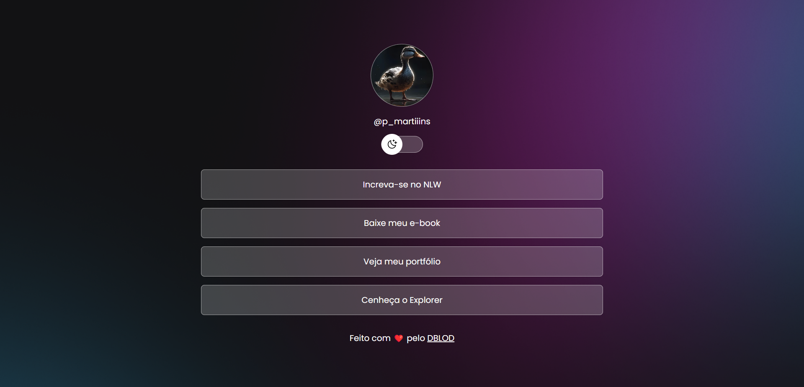

<h1 align="center" style="font-weight: 700">🔗 DevLinks 🔗</h1>

🙋 <strong>Olá</strong> seja bem vindo ao meu projeto 🙋

🧾 Este projeto foi criado apartir do curso Rockeseat com a atualização do Discover 🧾

📅 Criado em 25/05/2023 📅

 

 
 

<h1 style="font-weight: 700;">🚀Tecnologias</h1>

Esse projeto foi desenvolvido com as seguintes tecnologias:

<ul>
    <li>HTML 🦴</li>
    <li>CSS 👄</li>
    <li>JavaScript 🧠</li>
    <li>Figma 🖌️</li>
    <li>Git/Github 📤</li>
</ul>

 

<h1 style="font-weight: 700;">💻Sobre</h1>

O DevLinks é um agregador de links para usar como um cartão de visitas online.

 

<h1 style="font-weight: 700;">📜Licença</h1>

Esse projeto está sob licença MIT.

 

Feito com ❤️ by Dblod 🤙 <a href="https://www.dblod.com">Entre em contato 📞</a>
